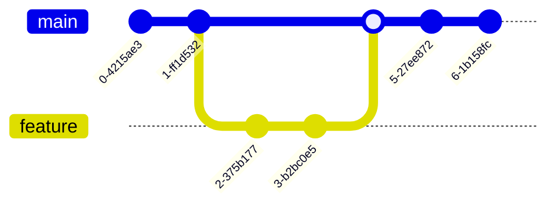

# Troubleshooting

## ModHeader

- ModHeader will break Google drive if Authentication Bearer token is set. The Google drive website pops up a dialog saying:

    ```text
    "You are not signed in.
    You are signed out. Sign back in, then click 'Retry'.
    Retry"
    ```

    The solution is to disable the Authentication header and Google drive will work as normal.

## Git graphs

### Feature branch and merge



### Feature branches and merge


