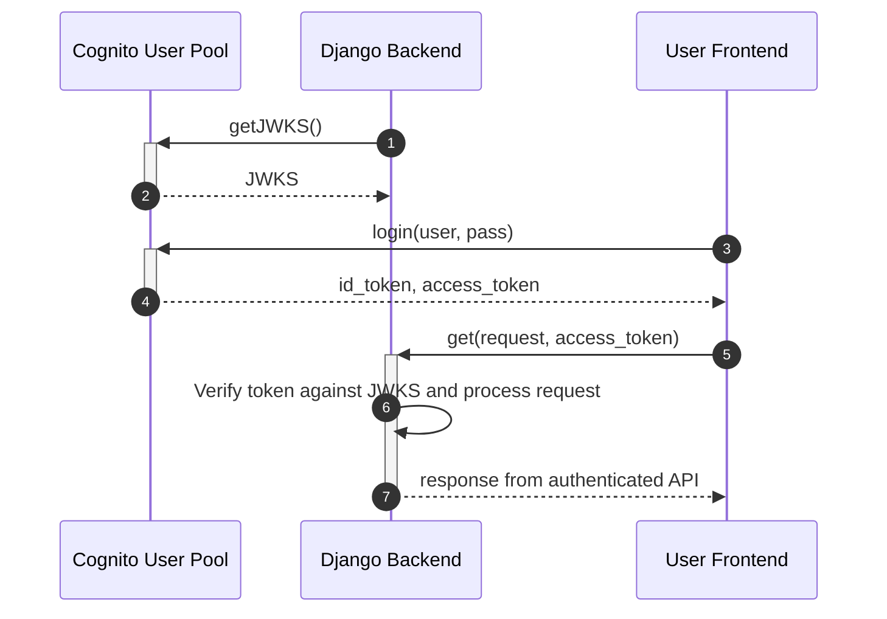

# Cognito authentication

## What is it

Cognito is a single sign-on system from AWS. It allows multiple apps to accept authentication from the same set of user accounts. It separates the management of users and permissions from the applications that use them.

## Why we use cognito

We're invested in AWS, so we might as well use this too.

## How we implement it

We're following the implementation from the [djangostar tutorial](https://djangostars.com/blog/bootstrap-django-app-with-cognito/).

These are the steps involved:

1. Backend downloads JWKS from Cognito User Pool on launch
1. User submits credentials and gets id_token and access_token
1. User sends request with token
1. Backend verifies token and processes request
1. User gets response from authenticated API

## Current Dev Setup

1. Created app client called "backend within the vrms-dev user pool, with ALLOW_ADMIN_USER_PASSWORD_AUTH enabled
1. "Domain Name" is already created at [https://hackforla-vrms-dev.auth.us-west-2.amazoncognito.com](https://hackforla-vrms-dev.auth.us-west-2.amazoncognito.com)
1. In "App client settings", enabled Implicit grant and openid, Callback URL [http://localhost:8000/admin](http://localhost:8000/admin)

## How it works now with the dev user pool and local development backend

1. [Create a cognito user](https://hackforla-vrms-dev.auth.us-west-2.amazoncognito.com/login?client_id=3e3bi1ct2ks9rcktrde8v60v3u&response_type=token&scope=openid&redirect_uri=http://localhost:8000/admin) and login from the Hosted UI (from App client settings). Successful login will redirect to localhost:8000/admin with the necessary tokens
1. Take the access_token from the URL and make a GET request to http://localhost:8000/api/v1/me (Headers key=Authorization, value=Bearer <token>)
1. Backend should return the user's profile data

## Authentication Guide for Cognito

Before following the below instruction, please ensure you have docker up and running and the build-image running, you can run it with the command `./scripts/buildrun.sh`.

1. Login (or register first then login) to a cognito account [here](https://hackforla-vrms-dev.auth.us-west-2.amazoncognito.com/login?client_id=3e3bi1ct2ks9rcktrde8v60v3u&response_type=token&scope=openid&redirect_uri=http://localhost:8000/admin). Do not worry if you see error messages - you will be using the url to authenticate.
1. Copy the URL when it redirects, and now in the new tab open the [online tool](https://regexr.com/6ro69).
1. You will notice `^.*access_token=(.*)&expires_in.*$` this is the regex used to extract the access_tokens.
    - Clear the top box and paste the URL text into it. Make sure you have `Replace` selected and `$1` in the bottom box, The upper box should show there's 1 match.
    - The bottom box's content is the extracted `access_token`.
1. Open [ModHeader](https://modheader.com/modheader/download)(for best results we recommend using Google Chrome).
    - If the icon is hidden, `click on the Puzzle icon in the upper right of the browser to see it`.
    - Select `Authorization` then type the word `Bearer` and paste the token into [ModHeader](https://modheader.com/modheader/download), it should follow the format: `Authorization: Bearer <access_token>`.
1. To make sure that you are correctly authorized, you can go to the following api-interfaces.
    - Local hosted [DjangoRestFramework](http://localhost:8000/api/v1/me)
    - Explore APIs using local hosted [Swagger](http://localhost:8000/api/schema/swagger-ui)
    - A local hosted [redoc ui](http://localhost:8000/api/schema/redoc) is also available

## Notes

The tutorial is 2 years old now (from 2020) and there's been some change made since then.

1. We created an app client in Cognito for the backend to interface with. ALLOW_ADMIN_USER_PASSWORD_AUTH is the new name for the old ADMIN_NO_SRP_AUTH setting. [Reference](https://docs.aws.amazon.com/cognito/latest/developerguide/amazon-cognito-user-pools-authentication-flow.html)
1. In the custom User model step, the ugettext-lazy package is gettext-lazy for Django 4.0 [Reference](https://forum.djangoproject.com/t/importerror-cannot-import-name-ugettext-lazy-from-django-utils-translation/10943/3)
1. The tutorial steps don't include instructions to test each step, so it's a little bit of following blindly with the help of linters until the last step.
